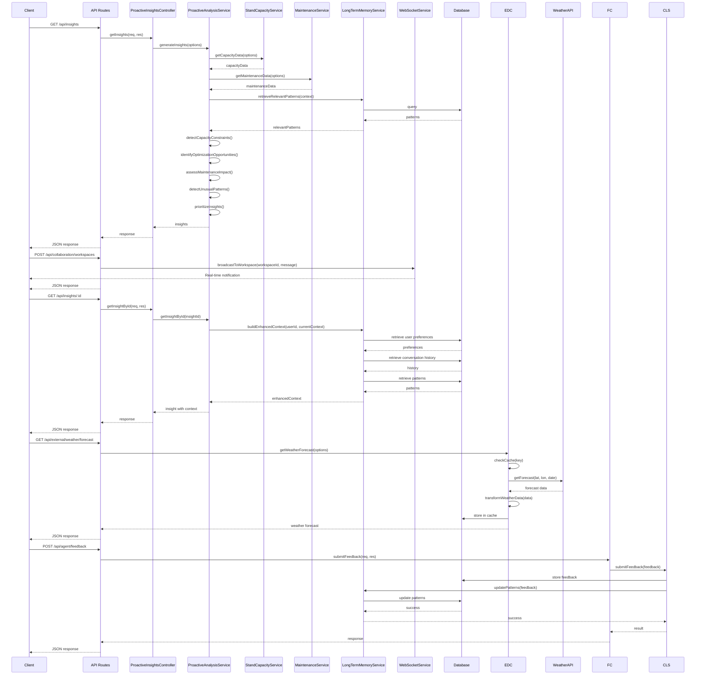

# AirportAI Agent Phase 3 - Sequence Diagram

Note: In this diagram:
- PC = ProactiveInsightsController
- PAS = ProactiveAnalysisService
- SCS = StandCapacityService
- MS = MaintenanceService
- LTM = LongTermMemoryService
- WS = WebSocketService
- EDC = ExternalDataConnectorService
- FC = FeedbackController
- CLS = ContinuousLearningService